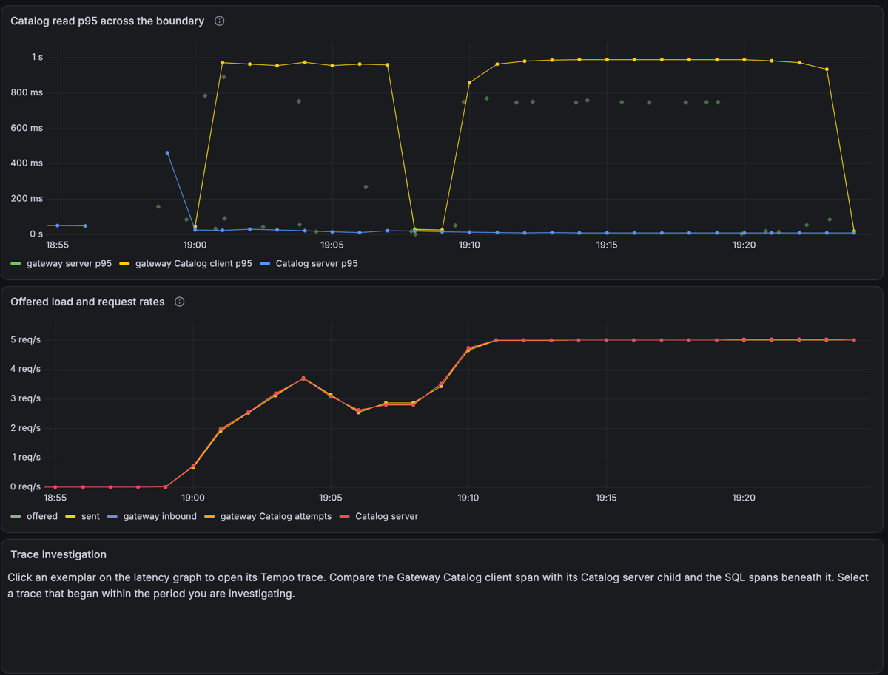
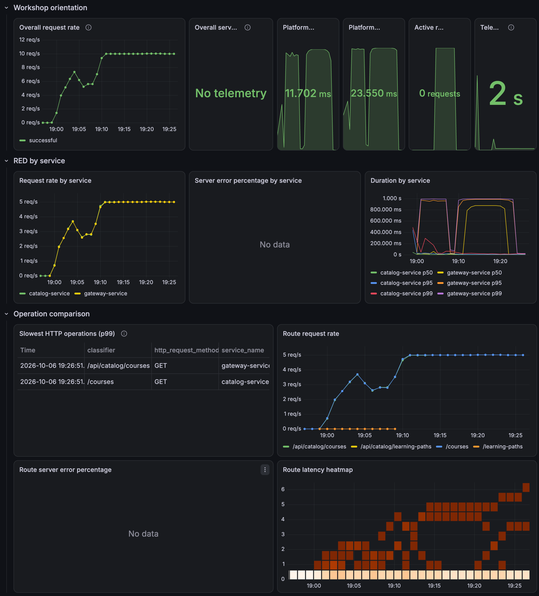

# Observability lab facilitator playbook

This is the operating guide for a facilitator running **A Distributed System On
Fire: Diagnosing Failures with otel4s**. It contains the hidden setup and
diagnosis. Share only the **participant brief** in the round section with
attendees. [lab-scenarios.md](lab-scenarios.md) is the scenario specification;
this file is the sequence of actions to run the workshop.

Workshop-wide ideas from live testing are collected in
[Global lab ideas](docs/lab-global-ideas.md) for a joint review after testing.

## Current readiness

Scenario 1 is rehearsed on the full stack. Scenario 3 has a prebuilt exercise
source, Identity traffic, and a workload check; its timing remains sensitive to
host capacity. Scenario 4 has a rehearsed mixed-actor workload and seeded
Playback projections; recheck it on the workshop host before presenting it.
Scenario 5 has an exercise source, deterministic mixed workload, pool telemetry,
and one full-stack rehearsal; calibrate it on the minimum supported hosts. The other live rounds in
[lab-scenarios.md](lab-scenarios.md) are designs, not runnable playbook steps yet.
Do not advertise the complete two-hour sequence until those rounds and their
reset paths have been rehearsed. Scenario 1 has not yet been calibrated on the
minimum supported laptop and Codespaces environments.

The platform change list currently contains the relevant change and any
changes from previous runs on that machine. Plausible unrelated changes have
not been added yet; do not rely on the change list as a difficult search task.

## How to use this playbook

Keep the same rhythm for every round as more scenarios become runnable:

1. **Prepare:** Start the stack, check telemetry, and establish a healthy
   traffic window.
2. **Present:** Give only the user symptom. Keep the hidden mechanism and
   expected diagnosis in facilitator notes.
3. **Investigate:** Ask for the affected population and start time, then for
   rate, error, latency, trace, and adjacent-layer evidence.
4. **Remediate:** Have participants apply the smallest reviewable correction.
   Keep the triggering workload unchanged.
5. **Verify:** Require a fresh sustained healthy window and new traces. Record
   the lesson that transfers to participants' own services.
6. **Reset:** Leave fault controls healthy before the next group or round.

Use a shared worksheet with these fields: symptom and affected users; first
abnormal signal; adjacent layers ruled out; decisive trace or log evidence;
change inspected; fix; recovery evidence; and transfer lesson.

### Participant onboarding — share before the first round

Open with: **You do not need to know this system in advance to investigate a
failure when you have good telemetry.** Use the evidence to discover the request
path, narrow the affected boundary, and test an explanation. Source and platform
history are available when the evidence points there.

Give a short tool tour before announcing any incident:

- **Workshop Overview:** find affected services and routes, then follow dashboard links.
- **Gateway and Catalog Boundary:** compare caller/server timings and request rates.
- **Tempo:** follow an exemplar to a trace; inspect child spans and SQL timings.
- **Platform CLI:** review recent changes, inspect a candidate, and roll back a
  change when the evidence supports it. These commands are available in every round;
  their availability does not imply a platform change caused every incident.

Provide this command card to participants (replace `CHANGE_ID` with an actual ID):

```bash
./scripts/lab.sh help
./scripts/lab.sh platform --help
./scripts/lab.sh platform changes
./scripts/lab.sh platform inspect CHANGE_ID
./scripts/lab.sh platform rollback CHANGE_ID
./scripts/lab.sh traffic status
```

Demonstrate help and navigation before the fault; do not demonstrate a rollback
as part of onboarding. Ask participants to record a hypothesis and supporting
trace before changing anything. Keep facilitator activation and solution notes
separate from this card.

### Teach concepts when participants use them

Use short explanations beside the live evidence. Allow roughly three minutes
of distributed teaching in round 1, then 30–60 seconds for each later round's
new concept. Include these pauses in rehearsal timing. Preparation and rebuild
waits are useful opportunities, but check readiness separately: finishing an
explanation does not mean the system has finished warming up.

| Moment | Short explanation to say or demonstrate |
| --- | --- |
| Round 1 baseline is warming up (30–45s) | “A metric summarizes observations over time. Each labeled series describes a group, such as one service and route. These graphs help us see when behavior changes and who is affected.” Point to the axes, units, route, and time range. |
| First latency comparison (30s) | “This p95 estimates the duration below which 95% of the observed requests fall. Here it is calculated from histogram buckets over the last 60 seconds.” Contrast it with the mean and explain that it is a population summary. |
| First exemplar click (20–30s) | “An exemplar connects an individual measurement to its trace. It gives us a request to inspect from this period.” The linked request is not necessarily the p95 request or representative of every request. |
| First trace opens (45s) | “A trace follows one request across instrumented operations. Each span records an operation's timing and context; parent/child relationships help us reconstruct the path.” Show the caller, server child, and SQL spans. Nested or overlapping spans must not simply be added together. |
| Rollback and recovery window (30s) | “New requests can be healthy while a rolling metric still includes old slow requests. Check a fresh trace now, then check sustained recovery after the window clears.” Use the same offered load and verify errors and drops too. |

After each explanation, hand the investigation back with an evidence question:
“What can we conclude from this view, and what should we inspect next?” Teach
how to read the view before pointing out the incident-specific abnormality.
If a hint is needed, record it separately from concept teaching during rehearsal.

Introduce later concepts only when they become useful:

- **Round 3 — runtime signals:** request duration shows the symptom; CPU,
  scheduling, and unrelated lightweight requests help test whether execution
  capacity is constrained. Correlation is a lead to investigate, not proof.
- **Round 4 — diagnostic coverage:** a trace can contain a successful early
  check and a failed later stage. An uninstrumented stage leaves a gap in our
  explanation. Teach this when participants inspect the authorization evidence;
  leave the missing stage for them to identify and instrument.
- **Round 5 — gauges and completed observations:** a gauge describes current
  state, such as queued requests. A duration histogram in this lab records waits
  after they end, so it cannot by itself show how long still-queued requests have
  been waiting. Introduce this when comparing queue depth, oldest-wait age, and
  acquisition duration, without naming the leaking branch.

Explain logs when opening one: “A log records a discrete event and its context;
a trace ID can connect that event to the request.” Use an actual relevant event
if available. Do not manufacture a logging detour just to cover every signal.
Keep API details, histogram mathematics, sampling configuration, and telemetry
pipeline internals for questions or the debrief unless needed to interpret the
current evidence.

### Delivery formats

| Format | Who types the incident command? | What attendees need |
| --- | --- | --- |
| Projector/shared stack | Facilitator, from the repository root | The symptom brief, Grafana, and a view of the participant commands when relevant. |
| Individual laptops | Each attendee, after the facilitator announces the exercise code | A running local stack, the repository, and local Grafana. Each laptop has its own traffic stream, change ledger, and fault state. |

The neutral incident command is safe to project. The `proxy` commands and the
diagnostic sections below are facilitator controls. The source and facilitator
documents are in the repository, so the exercise code is a presentation aid,
not a secrecy mechanism.

### Request deadlines

Gateway reads `UPSTREAM_REQUEST_TIMEOUT` (default `10 seconds`, positive and
finite). Native http4s `Timeout` middleware bounds the time to produce the
upstream response, including connection and pool waits and transport attempts.
Expiry cancels the handler and returns HTTP 504. It does not bound subsequent
response-body streaming; the generator's request deadline covers body
consumption. Ember has no separately configured connection timeout.
Cancellation of downstream service work still needs a running-lab rehearsal.

The traffic generator bounds actor preparation with `--setup-timeout` (default
`60s` for the whole setup). Expiry fails the command before measured traffic
starts. Setup time is excluded from the traffic measurement window. Existing
`--request-timeout` and `--drain-timeout` govern measured requests and shutdown.
Keep the generator deadline longer than Gateway's when recording Gateway's
failure status. Round 5 uses `15s` against Gateway's `10s`.

## Before the session

From the repository root, on every machine that will run the lab:

```bash
bash scripts/setup.sh --check
./scripts/lab.sh start --build
./scripts/lab.sh status
./scripts/lab.sh proxy check
```

Use `./scripts/lab.sh start --build` in place of `start` when running an
unpublished branch or commit. The image workflow publishes automatically from
`main` and version tags; a feature branch's commit-tagged images usually do
not exist in GHCR. Build before attendees arrive, since this can take several
minutes. The later `status` and `proxy check` steps are the same either way.

The setup check expects a JDK 17+, sbt, Docker Compose v2, Docker Buildx, and a
running Docker daemon. `start` launches the full application, including
PostgreSQL, Kafka, Debezium, SeaweedFS, frontend, Toxiproxy, and LGTM. It
normally pulls images tagged for the current Git commit. If the pull fails,
check the printed tag and startup log. An `unauthorized` response can mean the
tag is unavailable or that registry access is required. Retry with `--build`
for this checkout when the image has not been published.
The startup log path is printed by the script. Do not start a group exercise
until startup and readiness checks complete.
Traffic commands use the running Gateway container's image prefix and tag by
default, so a locally built stack uses its local generator image in a new shell.
All lab commands use the Scala lab CLI. `./scripts/lab.sh` stages it with sbt on
first use. CI also provides a `lab-cli-jvm` ZIP artifact;
its `bin/lab-cli --root /path/to/checkout` launcher can run from outside the
checkout, with Java 17+ installed.

Open the application at `http://localhost:8000` and Grafana at
`http://localhost:3000` (`admin` / `admin` in the local stack). In Codespaces,
use the forwarded URLs printed by startup. Open the **Workshop Overview**,
**Workshop Traffic**, and **Gateway and Catalog Boundary** dashboards. Confirm
they load. The Scenario 1 dashboard is linked from Workshop Overview.

Before admitting participants, run the automated rehearsal on the same image
set they will use:

```bash
./scripts/lab.sh verify scenario1
```

It takes roughly two minutes at its default observation windows, starts and
stops its own traffic, and resets the proxy on exit. It verifies aligned rates,
the latency symptom, a faulted distributed trace, participant rollback, and a
fresh recovery trace. A failure means the round needs investigation before it
is presented. The script prints the metric values and trace IDs it observed.
The independent generator summary is available with
`docker logs typelevel-video-streaming-lab-traffic` after the run.
Use `--grafana URL`, `--rate N`, and `--window SECONDS` when the local defaults
do not match the rehearsal environment; the window must be at least 35 seconds.

## Controlled workshop isolation

The checked-in source retains the intentional defects. Before each round, run
`./scripts/lab.sh prepare ROUND` (supported rounds: 1, 3, 4, 5). This stops the
named workshop generator, restarts the existing Identity, Catalog, Playback and
Gateway containers, waits for their health checks, and resets the Catalog proxy
and active platform ledger entries. Round 4 additionally performs actor/read-mode
setup; round 5 rebuilds Catalog with six sessions. Those existing setup steps
still compile local source. Start the stack before running preparation.

Use only the round's prescribed requests. Stop any separately launched foreground
generators and avoid browsing/searching during the demonstration: an arbitrary
empty Catalog search can activate the leak before round 5. Startup controls do
not make the faulty application safe for arbitrary exploration.

Preparation preserves the images and settings of restarted containers. It does
not revert source repairs or restore an original faulty image. Before repeating
an exercise after a repair, restore its intended source and rebuild the affected
service. Never run preparation between fault and recovery measurements: restarting
Catalog temporarily relieves the leak and invalidates that comparison.

`.lab/preparation.json` records the round, completion status, container IDs and
image IDs. A failed preparation is not a ready baseline; resolve the failure and
rerun it. A completed preparation confirms container health and the Catalog proxy
request only. Check the round's functional baseline, generator reports and fresh
telemetry before activating the incident; TCP health alone is insufficient.

### Source repair and facilitator fallback

Participants edit source, review their diff, rebuild the affected service, and
prove recovery under the same workload. The source fixes in rounds 3–5 are part
of completing the exercise. Facilitators may use these fallback patches if a
group gets stuck, after reviewing any participant edits:

- `infrastructure/lab/solutions/scenario3.patch`: move verification to `IO.blocking`.
- `infrastructure/lab/solutions/scenario4-diagnostics.patch`: add bounded validation-stage events, retaining the faulty decoder.
- `infrastructure/lab/solutions/scenario4.patch`: wire the compatible subject decoder **after** the diagnostic patch.
- `infrastructure/lab/solutions/scenario5.patch`: scope Catalog session ownership.

Run `git apply --check PATCH` before `git apply PATCH`, substituting the chosen
path. Do not force a patch over participant changes. Round 4 has two ordered patches. Review diagnostic evidence before applying the
decoder correction; when resetting, reverse the decoder patch before the diagnostic patch.
A successful patch application is not recovery proof: follow the round's rebuild
and verification steps.

To repeat after using a fallback, first stop the generator and review `git diff`.
Use `git apply --reverse --check PATCH` followed by `git apply --reverse PATCH`
only if that exact patch is still present and reversing it will preserve other
work. For hand-written repairs, restore only the reviewed exercise edits manually.
Rebuild the affected service, then run preparation and the baseline again.

Generic `lab.sh rebuild` preserves the deployed Catalog pool size and Playback
workshop mode. Explicit scenario prepare/restore settings override these values.
If there is no existing container, Compose defaults apply.

## Round 1: slow Catalog-facing requests

### Participant brief — share this paragraph only

> Catalog-facing requests became slow shortly after a routine platform change.
> Locate the delay and restore normal response time. Use telemetry to explain
> where the added time occurs, then show that new requests recover while traffic
> continues.

### Facilitator preparation

First restore a healthy proxy and start one continuous Catalog-read stream:

```bash
./scripts/lab.sh prepare 1
./scripts/lab.sh traffic start --rate 5
./scripts/lab.sh traffic status
```

Allow **at least 75 seconds** for JVM warmup and a full 60-second metrics window;
extend warmup if the baseline is still changing.
Record the time, Gateway server p95, Gateway Catalog client p95, Catalog server
p95, and the four rates on the dashboard: offered, Gateway inbound, Gateway
Catalog client, and Catalog server. Check the generator report for
`load_valid=true`, no dropped arrivals, and no failures. Do not start a second
traffic process. Keep this process running through fault and recovery.

Then activate the incident. On a projector, the facilitator types it; on
individual laptops, announce the code and have attendees type it:

```bash
./scripts/lab.sh incident start 8f27
```

The command prints only `Applied traffic policy` on success. Facilitators can
use `incident start 8f27 --verbose` to show control details; do not project that
output. Participants discover change IDs through `platform changes`.
Note the activation time privately. Allow at least 75 seconds before comparing a
clean fault window; the boundary dashboard uses a fixed 60-second lookback
plus telemetry export and refresh delay.

### Investigation prompts

Ask these in order, without naming the fault:

1. Which requests are affected? Is the offered rate steady, and are requests
   failing or only slowing?
2. Which service or dependency call first accounts for the added latency?
3. Does the downstream server spend the same amount of time as its caller?
4. In one trace begun **after** activation, where is the time between the
   Gateway Catalog client span and the Catalog server child span? Are the SQL
   spans also slow?
5. Which recent platform change could explain that boundary evidence?

Use the **Gateway and Catalog Boundary** dashboard for aligned rates and p95
latencies. Click a latency exemplar to open a Tempo trace; select a trace from
the incident period. The **Workshop Traffic** dashboard and generator JSON
reports provide independent offered-load and drop accounting. An aggregate
p95 difference points to a boundary; compare individual spans for the actual
per-request gap.

Participants inspect and remediate through:

```bash
./scripts/lab.sh platform changes
./scripts/lab.sh platform inspect CHANGE_ID
./scripts/lab.sh platform rollback CHANGE_ID
```

`CHANGE_ID` is the value listed by `platform changes` (also printed during
facilitator activation with `--verbose`).
Rollback reconciles the proxy to the healthy mapping and can be repeated.
Participant remediation is the rollback, not a direct proxy reset.

### Expected evidence — facilitator only

- Gateway server and Gateway Catalog client duration rise together; Catalog
  server and SQL spans remain comparatively short.
- Offered, Gateway inbound, client-attempt, and Catalog server rates stay
  aligned. The generator reports no dropped arrivals or failed requests.
- A faulted trace contains a long Gateway Catalog client span with a short
  Catalog server child span. The request reached Catalog.
- The inspected east-west traffic-policy change shows a non-default Catalog
  egress delay. Rolling it back removes the delay.

On one local run at five requests per second, Gateway client p95 moved from
about 23 ms to 988 ms and back to 23 ms. Catalog server p95 stayed around
10–12 ms. These figures are examples, not thresholds to promise across
machines. The automated check uses broad smoke bounds; calibrate the live
timebox on the machines used for the workshop.

### Recovery and group walkthrough

Keep the same traffic running for **at least 75 seconds** after rollback.
Inspect fresh post-rollback traces immediately, then allow the 60-second
boundary window and export/refresh delay to clear before judging its p95.
Compare a recent recovery window with the recorded baseline: Gateway server
and client latency return near their healthy range, Catalog remains healthy,
rates remain aligned, and a **new** trace has a short client/server gap. Old
faulted traces remain in history and are not evidence of a failed rollback.

Have participants explain the cause using a trace and at least one rate
comparison. Close with the lesson: a slow dependency call does not establish
that the dependency's own work is slow; adjacent client and server spans locate
time at their boundary.

### Calibration evidence — 2026-10-06

The facilitator reported activation around 19:10 and rollback around 19:19
(displayed local time), with a healthy exemplar around 19:20 but the aggregate
latency graph recovering several minutes later. Preserve exact ledger timestamps
and trace start times on the next pass; terminal prompt time can precede command
execution and the ledger uses UTC.



This capture shows slow Gateway client timing with a fast Catalog server and
aligned request rates. A fresh healthy trace after rollback demonstrates that
request's recovery; it does not require a historical p95 window to clear at once.
The running Grafana data source was subsequently observed with a 60-second
configured interval, while Gateway metric samples were five seconds apart.
With `$__rate_interval`, that configuration creates a minimum four-minute window.
The boundary dashboard now uses a fixed 60-second window for both latency and
rates. Rehearse again to measure its recovery-display delay. The overview still
uses adaptive windows; use Query Inspector to record their expanded duration.



Overview follow-ups: the overall request rate sums service hops (about 10/s for
5 user requests/s through two services); absent error series currently display
`No data`/`No telemetry`; the heatmap needs query/rendering review. Do not interpret
those labels as confirmed telemetry loss or use the total as the offered rate.

### Reset for the next group

After recovery has been demonstrated:

```bash
./scripts/lab.sh traffic stop
./scripts/lab.sh proxy status
```

`proxy status` must show `enabled: true` and an empty `toxics` list. If a
participant did not complete rollback, use their change ID with
`./scripts/lab.sh platform rollback CHANGE_ID` first. `./scripts/lab.sh proxy reset` is a
facilitator escape hatch; follow it with the participant rollback command so
the local change ledger also records the repair. Let a new healthy telemetry
window accumulate before repeating the round. Do not clear Grafana history to
make the next run look clean.

## Round 3: Identity compute starvation

### Participant brief — share this paragraph only

> Authentication activity increased. Logins and unrelated lightweight Identity
> requests became slow, while PostgreSQL appears healthy. Explain where the
> delay occurs and make lightweight requests responsive under the same load.

### Facilitator preparation

Build the full stack from this checkout before the workshop so the checked-in
Identity exercise source is in the image. It runs synchronous password
verification in `IO.delay` from startup. Build the generator and start baseline:

```bash
./scripts/lab.sh traffic build
./scripts/lab.sh prepare 3
./scripts/lab.sh scenario3 baseline
./scripts/lab.sh traffic status
```

The baseline sends 30 requests per second through Gateway, with 5% logins and
95% authenticated `GET /users/me` requests from one synthetic actor. The
generator registers that actor once, then obtains a token. Keep its JSON
reports; the `operations` field separates login and current-user duration.
Allow at least 30 seconds for warmup. `load_valid` covers the entire generator
run; `window.load_valid` covers the latest reporting interval. Record any
earlier dropped arrivals, then use clean recent windows to assess ongoing load.
The Compose Identity service is limited
to four CPUs and configured with two Cats Effect compute workers for this
exercise. Calibrate on the actual laptop before presenting it.

Before activation, confirm Grafana loads and the telemetry container is
healthy. Keep `docker compose ps` and a brief `docker stats --no-stream` sample
for Identity and LGTM with the generator report. If the dashboard or exporter
becomes unresponsive, stop the round-3 generator with
`./scripts/lab.sh scenario3 restore`; do not treat missing telemetry as a
healthy result.

Activate the login-heavy mix with the neutral command:

```bash
./scripts/lab.sh incident start 3c91
```

This stops the baseline generator and starts a new one at the **same total rate**,
now 70% logins. Record the workload change time. Wait at least 25 seconds and
inspect `./scripts/lab.sh traffic status`. Require clean recent windows with
`window.load_valid=true`, no failures, and no new dropped arrivals before
interpreting latency. This is a
workload activation, so a brief gap between the two generator containers is
expected.

### Investigation prompts

1. From Workshop Overview, open **Identity Investigation**. Compare Identity
   `POST /auth/login` and `GET /users/me` p95 in the same 60-second window.
   Does the lightweight route slow even though it has no password verification
   span?
2. Open a fresh login exemplar from that graph. Compare the Gateway and Identity
   server spans with the SQL, password permit-wait, and password verification
   work spans. Open a current-user exemplar as a control. The password spans
   identify the expensive operation; short SQL children alone cannot prove
   where the rest of a request waited.
3. Compare password verification duration, permit wait, and active verifications
   on the Identity dashboard. Follow its links to the Identity Cats Effect and
   JVM views. Check the selected service and current instance, then compare
   scheduler drift/starvation, CPU, and thread signals with the route delay.
4. Only after recording the telemetry diagnosis, inspect `PasswordHasher.scala`:
   on which Cats Effect executor does synchronous Argon2 verification run?

The generator summary gives independent offered, completed, dropped, and
per-operation latency evidence. The new password spans and metrics contain
fixed operation names and durations only; they do not export the lab actor,
token, password, or hash. Spans can lag or disappear under saturation, so use
the generator report, runtime metrics, and container health together.

### Participant remediation and proof

Participants identify the `IO.delay` boundary, explain the unrelated request
slowdown with telemetry and source evidence, then implement and verify the repair.
Change verification to `IO.blocking`
in `backend/services/identity-service/src/main/scala/org/typelevel/video/streaming/backend/identity/PasswordHasher.scala`. Keep the existing
permit ownership around both hash and verify. The semaphore limits
concurrent Argon2 operations to four. Review the source diff, then deploy it:

```bash
./scripts/lab.sh rebuild identity-service
```

Keep the 30 requests per second, 70% login workload running across the rebuild.
After warmup, require a fresh sustained window with `load_valid=true`, no
drops, and a lower `identity-current-user` latency. Check fresh traces and SQL
timing. In one local rehearsal of the checked-in exercise image, current-user
mean latency moved from 9.6 ms in the light mix to 61.5 ms in the heavy mix;
both samples used valid load. These are local calibration examples, not
universal thresholds.

The facilitator can run `./scripts/lab.sh verify scenario3` before the session. It
runs light and heavy samples against the prebuilt exercise image and checks that
the lightweight operation slows under valid load. It does not edit source.

### Reset for the next group

```bash
./scripts/lab.sh scenario3 restore
```

This stops the generator. If participants changed source and rebuilt Identity,
restore the exercise checkout or redeploy its prebuilt image before the next
group. Do not clear telemetry history.

## Round 4: stable minority-user Playback 401

### Participant brief — share this paragraph only

> A small, repeatable share of authenticated Playback requests returns `401`.
> Those users can log in, and most users are unaffected. Find the compatibility
> boundary without weakening authentication.

### Facilitator preparation

Build the current checkout so Identity can issue both documented subject
formats. Playback intentionally accepts only raw UUID subjects. Its workshop
read mode skips Kafka projection consumption; the setup command enables it, registers ten
legitimate actors and seeds their Playback user rows directly. It assumes the
default local Gateway port `8085`.

```bash
./scripts/lab.sh rebuild identity-service
./scripts/lab.sh traffic build
./scripts/lab.sh prepare 4
./scripts/lab.sh scenario4 baseline
./scripts/lab.sh traffic status
```

The baseline sends 10 authenticated `GET /api/playback/favorites` requests per
second from eight old-format actors. Identity authenticates all ten accounts
during generator setup, including the two newer-format accounts, before
starting traffic. Verify clean recent windows and `200` responses.

Start the mixed workload with the neutral participant command:

```bash
./scripts/lab.sh incident start 7b42
```

The same ten requests per second now use the two newer-format actors for 20%
of slots. Actor identities and routing remain stable. Observe roughly 20%
`401` responses while `load_valid` or recent `window.load_valid` is true and
there are no dropped arrivals. Do not publish token contents, subjects, user
IDs, or actor labels as telemetry attributes.

### Investigation prompts

1. Does Identity login work for both groups? Is Gateway reaching Playback?
2. Where does the Playback trace end? Do rejected requests reach repository
   spans or SQL?
3. Which stage of token validation differs: signature and standard claims, or
   subject decoding? Add bounded stage reasons or small spans, then use a new
   rejected trace to demonstrate the failing stage. This step is required.
4. Inspect `AccessTokenVerifier.userId` and Playback's wiring in `Main.scala`.

### Step 1: diagnostic telemetry and proof

Keep the original decoder. Add bounded validation-stage events or spans to the
existing Playback request trace. Do not export tokens, subjects, user IDs, actor
labels, JWT claims, or verification exception messages. Do not weaken validation
or change which requests succeed as part of this step.

The facilitator fallback `scenario4-diagnostics.patch` adds these events with
`auth.result=accepted|rejected`:

| Event | Meaning |
| --- | --- |
| `auth.jwt.verify` | Signature and the JWT library's configured claim checks |
| `auth.subject.decode` | Application subject-format decoding |
| `auth.claims.validate` | Additional date-order and canonical JWT-ID checks |
| `auth.principal.decode` | Application principal construction |

Later stages are absent when an earlier stage rejects. A successful
`auth.jwt.verify` does not imply that all application checks succeeded. These
are diagnostic events, not measurements of stage duration.

Rebuild Playback with diagnostics while the same mixed workload continues.
After restart/warmup, capture a fresh successful trace and a rejected trace.
**Required checkpoint before the decoder repair:** the rejected trace shows
`auth.jwt.verify=accepted` followed by `auth.subject.decode=rejected`; rejection
still occurs at approximately the same workload share. Record the trace IDs and
explain why database work is not reached. The successful trace must show the
validation path completing. A source inspection or aggregate 401 rate alone
does not complete this checkpoint.

### Step 2: decoder repair and recovery proof

Keep the diagnostic telemetry. Change Playback's verifier wiring to `AccessTokenVerifier.userIdCompatible`.
That decoder accepts exactly a canonical UUID or `user:` followed by a
canonical UUID. It retains RS256 signature, issuer, audience, expiry, issued-at,
and JWT ID checks. Rebuild Playback while keeping the mixed workload at the
same rate:

```bash
./scripts/lab.sh rebuild playback-service
./scripts/lab.sh traffic status
```

The rebuild can briefly produce `500` responses while the service restarts;
judge recovery from a later fresh window. Require that window to be valid with
all Playback requests returning `200`. Capture fresh traces showing accepted
subject decoding and principal construction, including a controlled replay from
a previously rejected actor. Keep actor-to-trace correlation local to the
exercise; do not add identifying telemetry labels. Run
the verifier suite to check malformed, expired, incorrectly signed, and
unsupported tokens remain rejected:

```bash
sbt --batch 'runtime/testOnly *AccessTokenVerifierSuite'
```

Restore the original Playback verifier wiring and remove the exercise-added
diagnostics before repeating the instrumentation lesson. If using fallback
patches, reverse the decoder patch first, then the diagnostic patch. Run
`./scripts/lab.sh scenario4 restore` after restoring the source. It stops traffic and rebuilds Playback
in normal projection mode. Leave the seeded accounts and projection rows in
place; preparation is idempotent.

## Round 5: Catalog PostgreSQL session depletion

### Participant brief — share this paragraph only

> Catalog starts healthy, then gradually slows until unrelated reads also wait
> for database access. A restart gives only temporary relief. Find the request
> pattern that consumes capacity and prove a durable repair.

### Facilitator preparation

The exercise Catalog source in this checkout manually allocates a Skunk session
for `ListCourses`. A valid empty search returns `200` but fails to return the
session. Nonempty searches, errors, and cancellation return their sessions.
The `catalog-soak` generator profile sends 5 requests per second: 90% course
reads and 10% LearningPath reads, in a fixed 50-slot pattern. Course reads mix
unfiltered and matching searches with a 2% unmatched search. The unmatched
query is a plausible course topic absent from the seeded catalog. All course
reads share the same generator operation label.
Keep this mechanism private until the walkthrough.

Before attendees join, run `./scripts/lab.sh traffic build` and
`./scripts/lab.sh verify scenario5`. The rehearsal rebuilds Catalog with six
sessions, samples healthy and mixed workloads for about two minutes, checks
pool depletion in Grafana and unrelated read slowdown, then restores the
normal pool size. It needs a running stack and Grafana at `localhost:3000`;
pass `--grafana URL` for a forwarded endpoint. A failed rehearsal needs
investigation before presenting the round.

Build the current exercise image and start a healthy window:

```bash
./scripts/lab.sh prepare 5
./scripts/lab.sh scenario5 baseline
./scripts/lab.sh traffic status
```

`prepare` sets Catalog's pool to six sessions. Allow 30–40 seconds of baseline
traffic and confirm a recent `window.load_valid=true`, successful requests,
near-zero acquisition time, and pool occupancy that returns to zero. Open the
**Catalog Sessions** dashboard from Workshop Overview. Record the baseline and
the activation time; keep the same 5 requests per second through the round.
The dashboard legend includes the Catalog instance ID. After a rebuild, use
the new instance's series for recovery; old series remain in telemetry history.
The oldest-wait age is calculated at each metric collection: it grows while
a request stays queued and returns to zero when no requests are waiting.
Canceling the oldest waiter can lower the age to that of the next waiter.

Activate the mixed search workload with the neutral command:

```bash
./scripts/lab.sh incident start d5e0
```

The generator switches profiles with a short gap. An empty search appears every
ten seconds at this rate, so the six-session pool should drain progressively
over about a minute. Watch at least two complete 50-slot cycles before
concluding anything. Gateway has a ten-second upstream response deadline; the
generator allows fifteen seconds so it can normally observe Gateway's HTTP 504
after depletion. The offered rate remains five per second.
Check `window.load_valid` and dropped arrivals before interpreting the
latency. This timing is a starting point and must be calibrated on the actual
workshop host.

### Investigation prompts

1. Which course request pattern precedes each step in checked-out session
   count? Replay suspected searches: do they return an HTTP error or a normal
   empty page?
2. When later course and LearningPath reads slow, is time spent acquiring a
   session or executing SQL after one is acquired?
3. Compare `catalog.session.active`, `catalog.session.waiting`, and
   `catalog.session.wait.max_age` on the dashboard with fresh traces and Skunk
   SQL spans. The acquisition-duration histogram includes completed waits but
   cannot time requests still queued indefinitely. A span without SQL may be
   waiting for a session.
4. Inspect `CatalogRepositoryImpl.listCourses`. What happens to the release
   action on every successful, empty, failed, and cancelled path?

The generator's `operations` JSON object separates course reads from
LearningPath reads; it does not identify empty searches. Compare searches and
their responses while watching session occupancy to find the pattern. The
dashboard's bounded route labels show that the effect spreads beyond the
triggering operation. A Catalog
restart temporarily empties the pool, but the same mixed workload drains it
again; do not accept a restart or larger pool as remediation.

### Participant remediation and proof

Replace manual `sessions.allocated` handling in `listCourses` with
`sessions.use`, keeping the existing select/count queries and page result.
Add a focused repository test covering nonempty and empty results, query
failure, and cancellation with a small instrumented session resource: each
acquisition must have one release. Review the diff, then rebuild with the same
six-session pool while mixed traffic continues:

The facilitator's reviewed minimal correction is in
`infrastructure/lab/solutions/scenario5.patch`. Keep it out of the attendee
brief; it also switches the existing Catalog service tests back to a pooled
session fixture so Skunk's leak detector checks empty-result finalization.

```bash
./scripts/lab.sh scenario5 rebuild
./scripts/lab.sh traffic status
```

The rebuild briefly interrupts requests. Start judging only after a fresh
post-rebuild window. Run the identical mixed workload for at least two minutes:
pool occupancy must return after requests, acquisition wait must stay bounded,
and both normal course and LearningPath reads must remain responsive. Require
recent valid generator windows without new dropped arrivals. Keep a fault trace
and a recovery trace for the group walkthrough.

On one local full-stack rehearsal, the exercise version filled all six sessions
and timed out 175 of 475 requests over a 95-second mixed run, with valid offered
load. The minimal repair completed 600 of 600 requests over a 120-second run,
including 12 empty searches and 60 LearningPath reads, with zero failures and
zero sessions checked out afterward. These are calibration examples, not
portable thresholds.

### Reset for the next group

```bash
./scripts/lab.sh scenario5 restore
```

This stops traffic and restores Catalog's normal ten-session setting. Restore
the exercise source checkout or redeploy its prebuilt image before the next
group. Leave Grafana history in place.

## If something goes wrong

| Symptom | Facilitator action |
| --- | --- |
| Startup cannot pull the commit-tagged images | Check the branch, image tag, registry access, and printed startup log. Images are published automatically from `main` and version tags. For an unpublished checkout, rerun `./scripts/lab.sh start --build`, then run `status` and `proxy check`. |
| Scenario 1 verification says the generator lost or failed requests | Inspect the printed generator JSON and `docker logs typelevel-video-streaming-lab-traffic` for drops, failures, and scheduler delay warnings. A cumulative `load_valid=false` means at least one arrival was lost during that run, even if the latest window is clean. Let the host settle and repeat the rehearsal with the same rate; keep the failed run's evidence. |
| No traffic series | Check `./scripts/lab.sh traffic status` and `docker logs typelevel-video-streaming-lab-traffic`; confirm the generator is running and `load_valid=true`. |
| Traffic drops or failures | Stop the round, inspect the generator JSON report and service health, and reduce the offered rate only for a new baseline/fault/recovery run. Do not change it mid-round. |
| Metrics are absent but requests complete | Check Grafana freshness and the generator JSON independently. Missing telemetry is unknown, not zero requests. |
| Fault command says a policy is already active | Inspect `./scripts/lab.sh platform changes`; roll back the active change before retrying activation. |
| Rollback succeeded but old slow traces remain | Select traces whose start times are after rollback and compare a fresh metrics window. |
| Proxy state and change ledger disagree | Use `./scripts/lab.sh platform rollback CHANGE_ID` to reconcile both. Reserve direct `proxy reset` for facilitator recovery. |

Use `./scripts/lab.sh stop` only after the session or when intentionally
clearing the full ephemeral stack. It stops the application and its data
containers, so it is not a between-round reset.

## Handoff record for the next facilitator

### Live calibration protocol

For a workshop simulation, follow presentation order: rounds 1, 3, 4, then 5
among the currently runnable rounds. Round 2 still needs implementation; record
that omission when timing the workshop. Round 5 is the final live incident.
The detailed round-5 procedure below can also be used independently to check
session metrics and timeout behavior. For each runnable round, do a technical
pass with facilitator notes, followed by a timed participant pass using only
the brief and investigation prompts. Record every hint needed and every step
where the next action was unclear.

Keep one evidence folder per run, outside the tracked source tree if convenient.
Record the commit, source diff (including participant repair), deployed image
IDs, OS/CPU, Docker CPU and memory allocation, delivery format, and workload
settings. Save `.lab/preparation.json` after preparation. Record timestamps in
UTC and use absolute Grafana time ranges so screenshots and traces align.
Capture evidence before profile switches, preparation, restore, or rebuild:
the generator container can be replaced, and service instance IDs change.

For round 5, use this sequence alongside the commands above:

| Phase | Action and evidence |
| --- | --- |
| Prepare | Start the current build, build the generator, run `prepare 5`, and check stack status. Confirm fresh telemetry and capacity six. Keep arbitrary browser searches out of the rehearsal. |
| Baseline | Run `scenario5 baseline` for at least 40 seconds. Save generator logs, a Catalog Sessions screenshot, and a healthy course trace. Record successes, drops, acquisition wait, and occupancy. |
| Activate | Record the exact UTC time of `incident start d5e0`. Keep 5 requests/s. Record first persistent occupancy increase, capacity exhaustion, first queued request, and first HTTP 504. About one minute to depletion is a hypothesis to measure. |
| Diagnose | Capture occupancy rising toward six and waiting requests appearing. Save a triggering empty-result request/response and a slow unrelated LearningPath trace. Identify acquisition waiting versus SQL execution; note any evidence unavailable until a span finishes. |
| Check deadlines | Distinguish Gateway HTTP 504 near 10 seconds from generator timeout near 15 seconds using status/outcome counts and request evidence. Record whether downstream waits actually finish after the response deadline. |
| Check cleanup | Save fault evidence, stop traffic, and wait through request/drain deadlines plus telemetry export delay. Record whether waiting and oldest-wait age return to zero. Leaked active sessions may remain at six. If waits persist, record duration and traces before resetting. |
| Resume fault | Restart the mixed workload with `incident start d5e0` without preparing/restarting Catalog. Record this intentional interruption. Confirm the depleted state before the repair. |
| Repair | Edit source, save the diff, and run `scenario5 rebuild`. Record rebuild duration and the new Catalog instance ID. Exclude the deployment interruption from recovery assessment. |
| Recovery | Observe at least 120 seconds of the same mixed workload after readiness. Save two generator reports bracketing this window, pool graphs, and fresh course and LearningPath traces. Require no new failures/drops, bounded waits, and sessions returning after requests. |
| Reset | Save evidence before `scenario5 restore`. Restore faulty exercise source deliberately, then prepare a new round and confirm a healthy baseline. Record reset time and any manual steps. |

The cleanup pause is a calibration check; omit it from the timed participant
pass, where mixed traffic should continue through diagnosis and repair.
Repeat the technical run at least twice on the intended host before publishing
a timing range. Repeat on the minimum supported host before claiming support
for that environment. If load is invalid, keep the failed run's evidence and
change settings only for a new complete run.

While requests remain queued, oldest-wait age should advance between collections.
It can drop when the oldest request leaves, and can settle into a repeating
pattern if deadlines cancel old waiters while new requests arrive. Do not require
an indefinitely increasing line. Missing/stale telemetry does not prove cleanup.

Save raw generator output at each phase, for example:

```bash
docker logs --timestamps typelevel-video-streaming-lab-traffic > round5-baseline-generator.log 2>&1
```

Use a different filename for each phase. The report's `window` fields describe
recent load validity; `statuses`, `outcomes`, and operation means are cumulative
within that generator process. Compare counter differences across the recovery
window; a cumulative mean includes earlier failures. Compare the same route
and workload when judging latency: the course-only baseline is not a healthy
LearningPath baseline. Use the repaired mixed run for that route's healthy
reference, or record a separate healthy control run.

### Screenshots and observations to add after rehearsal

Keep a small annotated set per round:

1. **Baseline overview:** rates/errors/latency, workload validity, absolute time.
2. **Fault overview:** same panels and scale, activation marked.
3. **Decisive trace:** service/operation names and timing visible, with a caption
   explaining which observation supports the diagnosis and which layer it rules out.
4. **Scenario-specific evidence:** for round 5, capacity/active/waiting/oldest
   age together, plus the empty successful response associated with a capacity step.
5. **Recovery overview:** sustained healthy window, new instance selected, same
   offered workload, plus a fresh recovery trace.

Keep raw traces or trace IDs, generator logs, and image IDs beside screenshots;
screenshots alone cannot establish cancellation or release correctness. Avoid
capturing credentials or bearer tokens. Use captions with the run ID, phase,
time range, expected observation, and measured observation. Link images beside
the relevant facilitator step; keep diagnosis images out of the participant brief.

For each run, fill this compact record:

```text
Run / round / host / commit / source changes / image IDs:
Preparation and baseline duration:
Workload, pool, timeout settings:
Activation / first symptom / decisive evidence timestamps:
Expected observation -> actual observation:
Trace IDs and evidence filenames:
Fix / rebuild duration / recovery window / counter differences:
Reset duration and next baseline result:
Hints required / confusing steps / missing panels:
Pass, fail, or inconclusive; gap IDs and next action:
```

Update the round's measured timing range, dashboard navigation, expected
evidence, and troubleshooting from these records. Mark calibration gaps complete
only after the required observation and reset have been demonstrated; adding
this checklist does not itself complete a rehearsal.

Record the repository commit or image tag, delivery format, host/Codespaces
size, setup time, fault activation time, rollback time, and recovery window.
Keep one baseline, fault, and recovery trace ID plus the generator summary.
Note any changed rate or timing and why. Before the next workshop, verify that
the attendee-facing brief still matches the commands and dashboard shown here.

## Adding later rounds

Add each round with the same headings used above: participant brief; facilitator
preparation; investigation prompts; expected evidence; participant remediation;
recovery proof; and reset. Keep exact commands and the workload rate beside the
step where they are used. Move a round from planned to runnable only after its
automated acceptance check and a human rehearsal pass on the delivery formats
the company will use.
